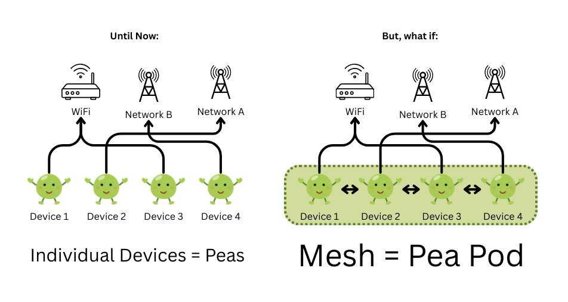

# PeaPod: Project PeaToPea

**PeaPod** is a protocol—like Bluetooth, WiFi, or Hotspot—that lets nearby devices form an encrypted local swarm and pool their internet connections to speed up uploads and downloads.



## What PeaPod is

Today, each of your devices connects to the internet on its own. Your phone uses cellular or WiFi; your laptop uses WiFi or ethernet; your tablet does the same. They don’t help each other. If one device has a slow link, it stays slow. If another has a fast link, that speed isn’t shared. PeaPod changes that by turning your nearby devices into a **pod**: a small mesh that talks to the internet as a coordinated group.

In that mesh, each device is a **pea**. Peas discover each other on the same local network (e.g. your home WiFi), authenticate using cryptographic identities, and form an encrypted **pea pod**. Inside the pod, devices communicate directly with each other over the local link. To the outside world, the pod can use whichever internet connection is available on any of its members. So instead of each pea connecting alone to “WiFi” or “Network A,” the pod collectively uses those connections and shares the work.

## How it works

- **Protocol.** PeaPod is a protocol. Operating systems and devices implement it. When you enable it (e.g. in device settings, alongside WiFi and Hotspot), your device advertises that it speaks PeaPod, discovers other PeaPod-capable devices on the same LAN, and joins or forms a pod with them.

- **Cooperative bandwidth.** When any device in the pod sends or receives data, the work is split into chunks. Each device uses its own internet connection to fetch or send its assigned chunks; chunks are then exchanged over the fast local link and reassembled on the device that requested the data. The result is faster downloads and uploads without changing ISPs, servers, or apps.

- **Transparent and safe.** Apps keep working as usual. PeaPod runs below the application layer and only accelerates traffic that supports it (e.g. HTTP range requests). Everything between devices in a pod is encrypted; devices are identified by cryptographic IDs, with no central server or logging.

- **Reference implementation and native clients.** This repo contains **pea-core** (shared protocol logic: identity, crypto, chunking, scheduling, integrity) in Rust—with no I/O so any platform can plug in its own discovery and traffic interception—and protocol implementations per OS: Windows, Android, Linux, iOS, macOS. Each implementation uses the right mechanism for that platform (system proxy, VPNService, Network Extension, etc.) so that any mix of devices can join the same pod.

PeaPod enhances the internet; it does not replace it.

Licensed under the [MIT License](LICENSE). For Rust dependency licenses: `cargo install cargo-license && cargo license`.

## Repo layout

- [.tasks/](.tasks/README.md) — Task breakdown and checklists for the full project.
- `pea-core/` — PeaPod protocol reference implementation (Rust library).
- `pea-windows/`, `pea-linux/` — Stub binaries for Windows and Linux implementations (in progress).
- `pea-android/` — Android app (Gradle/Kotlin); min SDK 24, target SDK 34. See [pea-android/README.md](pea-android/README.md).
- `pea-ios/` — Swift Package placeholder for iOS (Xcode 15+, [pea-ios/README.md](pea-ios/README.md)).
- `pea-macos/` — Swift Package placeholder for macOS (Xcode 15+, [pea-macos/README.md](pea-macos/README.md)).

## Build and test

From the repo root (requires [Rust](https://rustup.rs)):

```bash
cargo build -p pea-core
cargo test -p pea-core
```

Optional targets for platform implementations (add when working on that platform):

```bash
# Android (pea-android)
rustup target add aarch64-linux-android armv7-linux-androideabi i686-linux-android x86_64-linux-android

# iOS (pea-ios)
rustup target add aarch64-apple-ios x86_64-apple-ios

# macOS (pea-macos)
rustup target add aarch64-apple-darwin x86_64-apple-darwin
```

## Documentation

- **Project and task breakdown**: [.tasks/](.tasks/README.md) — Checklists and recommended order for building PeaPod.
- **Architecture**: [docs/ARCHITECTURE.md](docs/ARCHITECTURE.md) — Layer placement, components, and data flow.
- **Protocol**: [docs/PROTOCOL.md](docs/PROTOCOL.md) — Wire format, discovery, handshake, and versioning (reference: pea-core).
- **Contributing**: [CONTRIBUTING.md](CONTRIBUTING.md) — Branching, commits, and how to push to the PeaToPea repo.
- **Cursor**: Rules, skills, and subagents in [.cursor/](.cursor/) for consistent AI-assisted development (rules in `.cursor/rules/`, skills in `.cursor/skills/`, agents in `.cursor/agents/`).
