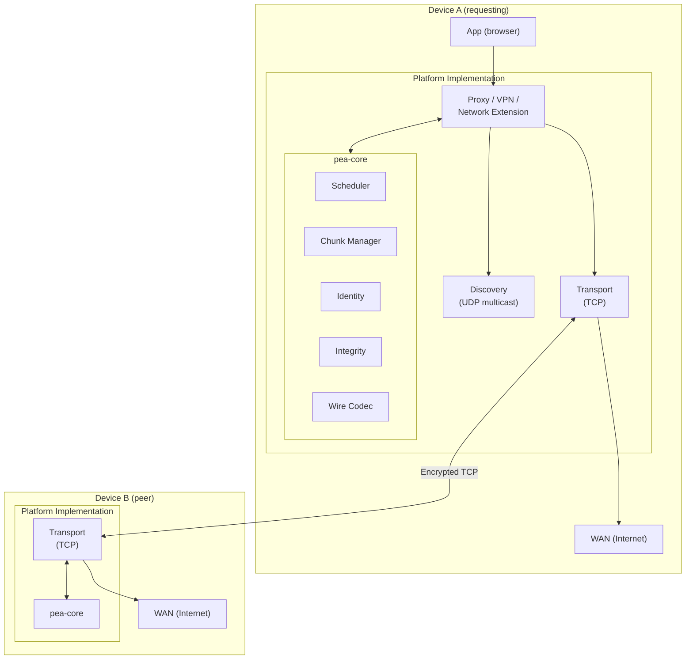
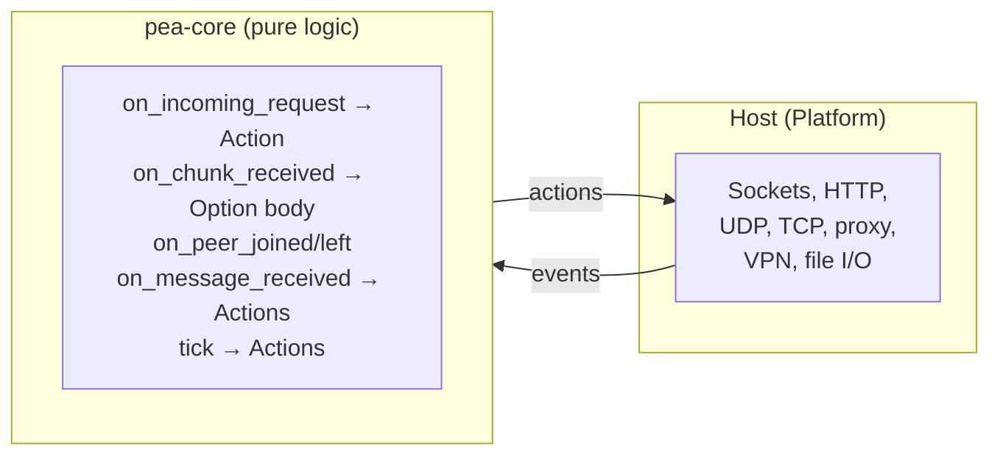
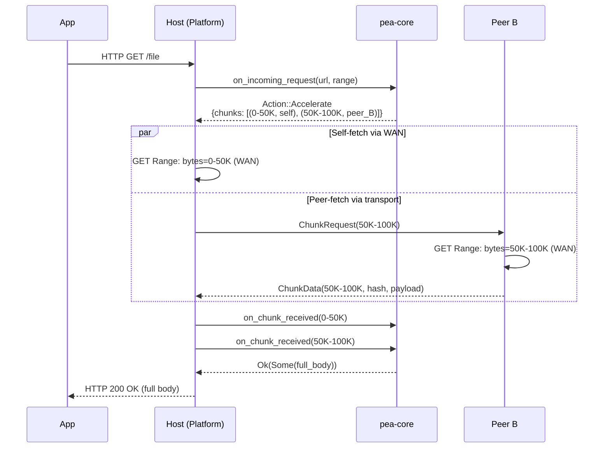
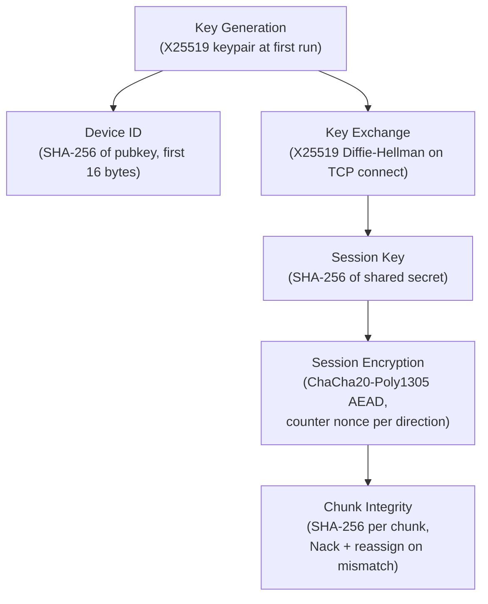

# PeaPod Architecture

## Overview

PeaPod is a cooperative bandwidth protocol. Nearby devices form an encrypted mesh ("pod") over the local network and split internet traffic across all members' connections. This document describes the architecture: layer placement, components, data flow, and how `pea-core` fits with platform implementations.

## Layer placement

PeaPod sits **above IP** and **below applications**:

```mermaid
block-beta
    columns 1
    block:app["Application (browser, app)"]
    end
    block:tcp["TCP / HTTP / TLS"]
    end
    block:peapod["PeaPod cooperative layer"]
        columns 3
        A["Intercept\n(proxy / VPN / NE)"]
        B["Schedule & chunk\n(pea-core)"]
        C["Transport\n(local TCP)"]
    end
    block:platform["Platform (proxy, VPN, Network Extension)"]
    end
    block:net["Network interfaces (WAN + LAN)"]
    end

    app --> tcp
    tcp --> peapod
    peapod --> platform
    platform --> net
```

Traffic is intercepted by the platform implementation (e.g. system proxy or VPNService). Eligible flows are handed to the cooperative layer, which uses pea-core for protocol logic. Chunks are fetched or sent via WAN and exchanged over the local link; the requesting device reassembles and delivers the result to the app.

## System architecture



## Core components

| Component | Location | Responsibility |
|-----------|----------|----------------|
| **Discovery** | Platform | Advertise presence and discover peers via LAN multicast/broadcast (same wire format on all platforms) |
| **Identity & encryption** | pea-core + platform | Device keypairs (X25519), device ID derivation, session keys, ChaCha20-Poly1305 AEAD encryption |
| **Scheduler** | pea-core | Assign chunks to peers (round-robin, weighted, or single-peer) based on availability and metrics |
| **Chunk manager** | pea-core | Split transfers into byte-range chunks, track state per transfer, reassemble completed chunks |
| **Wire codec** | pea-core | Encode/decode protocol messages (bincode, 4-byte LE length framing) |
| **Integrity** | pea-core | SHA-256 hash per chunk; verify on receive; reject and reassign on failure |
| **Local transport** | Platform | TCP connections between peers; framed + encrypted messages (pea-core defines format, platform does I/O) |
| **Traffic interception** | Platform | System proxy (Linux/Windows), VPNService (Android), Network Extension (iOS/macOS) |

## pea-core: host-driven, no I/O

The shared library **pea-core** contains no sockets, no file I/O, and no platform APIs. The host (each platform implementation) is responsible for:

- Discovery (sending and receiving beacons).
- Accepting and parsing incoming requests (e.g. HTTP with range).
- Sending and receiving framed messages to peers over TCP.
- Executing WAN requests for chunks assigned to self.
- Calling into pea-core with events (request metadata, peer joined/left, message received, chunk data received) and acting on returned values (chunk assignments, messages to send, reassembled stream).

This keeps pea-core portable and testable with mock hosts.



## Data flow: accelerated download



## Discovery and connection sequence

```mermaid
sequenceDiagram
    participant A as Device A
    participant LAN as LAN (multicast 239.255.60.60:45678)
    participant B as Device B

    A->>LAN: Beacon {ver, device_id_A, pubkey_A, port}
    LAN->>B: Beacon
    B->>LAN: Beacon {ver, device_id_B, pubkey_B, port}
    LAN->>A: Beacon
    B-->>A: DiscoveryResponse

    Note over A,B: TCP connection to B's listen_port

    A->>B: Handshake [ver | device_id | public_key]
    B->>A: Handshake [ver | device_id | public_key]

    Note over A,B: Both compute:<br/>shared_secret = X25519(my_secret, peer_pubkey)<br/>session_key = SHA-256(shared_secret)

    A<-->B: Encrypted chunk/control traffic (ChaCha20-Poly1305)
```

## Platform implementation matrix

| Platform | Traffic interception | Discovery | Transport | UI |
|----------|---------------------|-----------|-----------|-----|
| **Linux** | HTTP proxy (localhost:3128) | UDP multicast | TCP | CLI / systemd |
| **Windows** | System proxy (registry) | UDP multicast | TCP | System tray (Win32) |
| **Android** | VPNService | UDP multicast | TCP | Activity + Service |
| **iOS** | Network Extension (planned) | UDP multicast | TCP | SwiftUI (planned) |
| **macOS** | Network Extension (planned) | UDP multicast | TCP | Menu bar (planned) |

## Security model



- **Identity**: Each device generates an X25519 keypair at first run. The `DeviceId` is derived from the public key (SHA-256, first 16 bytes).
- **Key exchange**: On TCP connection, both peers exchange public keys and derive a shared secret via X25519 Diffie-Hellman.
- **Session encryption**: All frames after handshake are encrypted with ChaCha20-Poly1305 AEAD using the shared session key. Per-message nonce (counter) prevents replay.
- **Chunk integrity**: Each chunk carries a SHA-256 hash. The receiver verifies before accepting; mismatches trigger Nack and reassignment.
- **No central server**: Discovery is LAN-only (multicast TTL=1). No data leaves the local network except normal WAN traffic through each device's own internet connection.

## Cross-references

- **Protocol wire format**: [docs/PROTOCOL.md](PROTOCOL.md) — Message types, encoding, discovery, handshake
- **API reference**: [docs/API.md](API.md) — pea-core types and methods for platform authors
- **pea-core README**: [pea-core/README.md](../pea-core/README.md) — Build, test, C FFI, cross-compilation
- **Task breakdown**: [.tasks/README.md](../.tasks/README.md) — Implementation checklists
