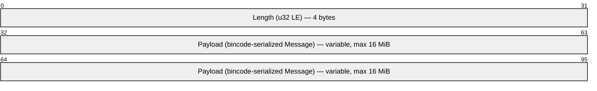
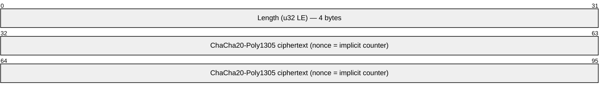
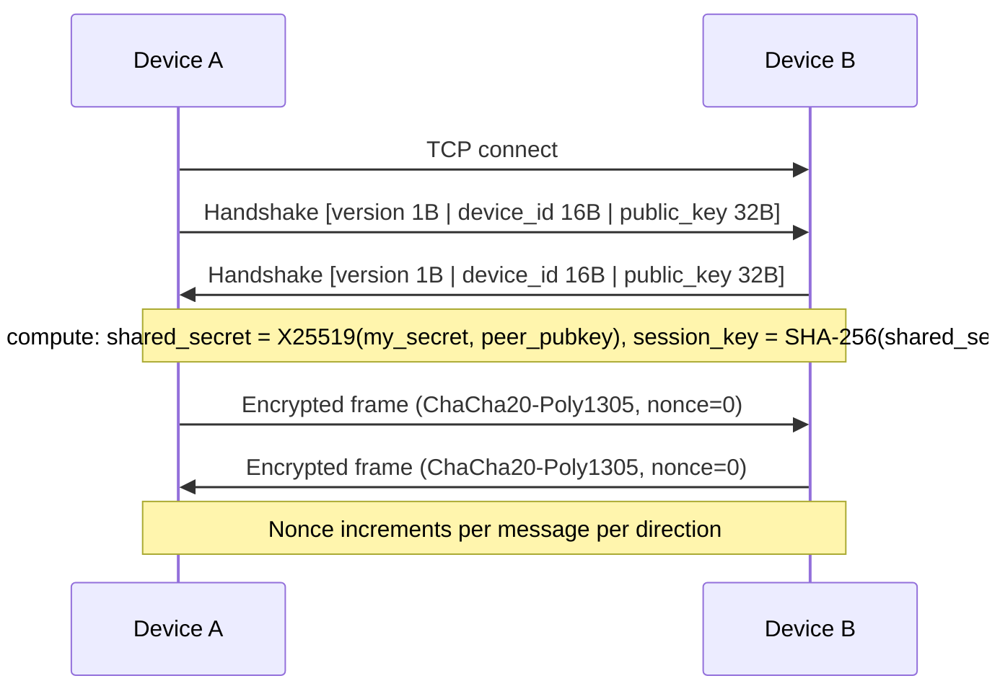
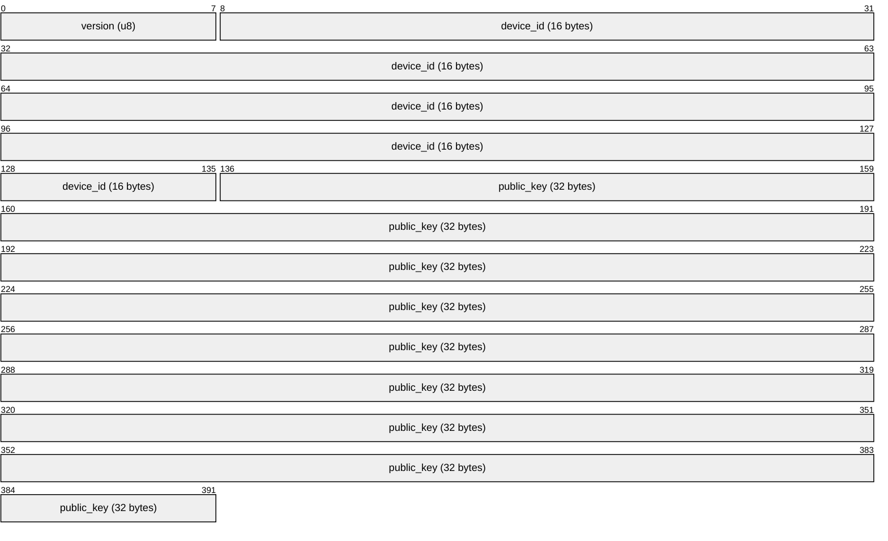

# PeaPod Wire Protocol and Discovery

This document specifies the wire format, discovery, and connection handshake so that every implementation (Windows, Android, Linux, iOS, macOS) can join the same pod. The reference implementation is in **pea-core** (Rust); other platforms may use pea-core or reimplement from this spec.

## 1. Wire format

### 1.1 Encoding

- **Encoding**: [bincode](https://docs.rs/bincode) (binary, compact).
- **Framing**: Each message is sent as a single frame: **4 bytes little-endian length** (u32) + **bincode-serialized payload**.
- **Max frame size**: 16 MiB (16 × 1024 × 1024 bytes). Frames larger than this are rejected.
- **Endianness**: Length is little-endian. Bincode uses little-endian for multi-byte integers.

After the TCP handshake, all frames are encrypted:

### 1.2 Message types and fields

All message variants and their fields (as in pea-core `protocol::Message`):

| Message           | Fields |
|-------------------|--------|
| **Beacon**        | `protocol_version: u8`, `device_id: DeviceId` (16 bytes), `public_key: PublicKey` (32 bytes), `listen_port: u16` |
| **DiscoveryResponse** | Same as Beacon |
| **Join**          | `device_id: DeviceId` (16 bytes) |
| **Leave**         | `device_id: DeviceId` (16 bytes) |
| **Heartbeat**     | `device_id: DeviceId` (16 bytes) |
| **ChunkRequest**  | `transfer_id: [u8; 16]`, `start: u64`, `end: u64` |
| **ChunkData**     | `transfer_id: [u8; 16]`, `start: u64`, `end: u64`, `hash: [u8; 32]`, `payload: Vec<u8>` |
| **Nack**          | `transfer_id: [u8; 16]`, `start: u64`, `end: u64` |

- **DeviceId**: 16 bytes (e.g. SHA-256 of public key truncated, or BLAKE2).
- **PublicKey**: 32 bytes (X25519).

Implementations in other languages (Kotlin, Swift, etc.) must use the same field order and types so that bincode (or an equivalent binary encoding that matches) produces compatible bytes.

### 1.3 Version field

- **protocol_version**: u8. Current version is **1**.
- Present in **Beacon** and **DiscoveryResponse** (and in connection handshake; see §3).
- **Compatibility**: Peers with a different **major** version may reject or be rejected; same major version is required. Minor version differences may be supported on a best-effort basis (future).

## 2. Discovery protocol

### 2.1 Transport and address

- **Transport**: UDP. Options (platform-dependent):
  - **Multicast**: e.g. group `239.255.60.60`, port `45678`.
  - **Link-local broadcast**: same port, broadcast on the local interface.
- **TTL/hop count**: 1 (same subnet only) when using multicast.
- All platforms (Windows, Android, Linux, iOS, macOS) use the same group and port so they can discover each other.

### 2.2 Beacon format

- **Payload**: Serialized **Beacon** message: `protocol_version`, `device_id`, `public_key`, `listen_port`.
- **Encoding**: Same as §1 (length-prefix + bincode). The entire frame is sent in the UDP payload.
- **Interval**: Beacons are sent periodically (e.g. every 3–5 seconds). All platforms should use a similar interval so discovery latency is consistent.

### 2.3 Response

- Receivers may send a **DiscoveryResponse** (same format as Beacon) to the beacon sender’s address, including their own `device_id`, `public_key`, and `listen_port`.
- Alternatively, “beacon received” can be considered sufficient for discovery (no explicit response). The chosen behavior should be documented per implementation.

### 2.4 Local transport address

- Each device advertises an address and port for the **local transport** (TCP or equivalent) used for chunk exchange and control messages.
- **Address**: Typically the device’s LAN IP (primary interface or derived from the multicast send socket). Platform-specific: how to obtain “my LAN IP” is documented in platform docs (08).
- **Port**: Fixed (e.g. `45679`) or ephemeral; if ephemeral, it must appear in the beacon or discovery response.

## 3. Connection handshake (local transport)

### 3.1 First message on TCP

- After a TCP connection is established, the first application-layer message is a **handshake**.
- Handshake content: **protocol_version** (u8) + **device_id** (16 bytes) + **public_key** (32 bytes) = 49 bytes total.
- Both sides send their handshake; each derives a **session key** from the two keypairs (e.g. X25519 key exchange). All subsequent messages are encrypted with this session key.
- If **protocol_version** is not supported, the connection is rejected and closed (no crash; log and optionally show "Peer is using a different PeaPod version" in UI).

Handshake frame layout (49 bytes, sent raw before encryption begins):

### 3.2 Encryption of subsequent messages

- **Cipher**: AEAD (e.g. ChaCha20-Poly1305). The reference core uses ChaCha20-Poly1305; the host typically performs encrypt/decrypt and passes decrypted bytes to pea-core.
- **Nonce**: Per-message nonce (e.g. counter per direction). No nonce reuse.
- **Frame**: e.g. `[nonce][ciphertext][tag]` or `[length][nonce][ciphertext]`; exact layout is documented in platform or security docs. AEAD provides integrity; no separate hash for control messages.

### 3.3 Chunk data messages

- **ChunkData** may carry a large payload. On the wire it is: chunk identifier (transfer_id, start, end), hash (32 bytes), and payload. The whole message (or the payload only) may be encrypted at the transport layer; the core receives decrypted **ChunkData** and verifies the hash. On hash mismatch, the receiver sends **Nack** and the chunk is reassigned.

## 4. Versioning and compatibility

- **Backward compatibility**: A new **minor** version may add optional fields or new message types; older peers should ignore unknown fields or message types where possible.
- **Major version**: A new major version may break the wire format. The upgrade path (e.g. supporting two major versions during transition) should be documented.
- **Reject and downgrade**: On beacon or handshake with an unsupported major version, do not add the peer to the pod (or mark as “incompatible”). Close the connection and log; do not crash. Document in user-facing docs: “Peer is using a different PeaPod version.”

## 5. Reference implementation

- **pea-core** implements all message types and wire encoding (see `pea-core/src/protocol.rs` and `pea-core/src/wire.rs`).
- Other platforms may use pea-core (Rust) or reimplement from this spec; the spec in this document and in 08-documentation must match pea-core behavior.
- Tests in pea-core encode/decode each message type and assert roundtrip; see `pea-core` tests.

## 6. Cross-references

- **.tasks**: [07-protocol-and-interop.md](../.tasks/07-protocol-and-interop.md) — Wire format, discovery, versioning, interop tests.
- **Architecture**: [docs/ARCHITECTURE.md](ARCHITECTURE.md) — Layer placement and data flow.
- **README**: [README.md](../README.md) — Repo layout and build.
