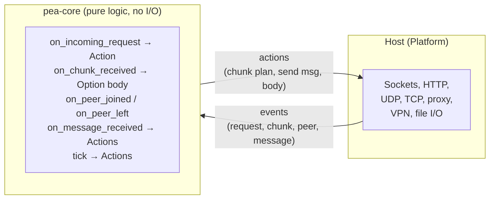

# pea-core

PeaPod protocol reference implementation — shared protocol logic used by all platform implementations (Windows, Linux, Android, iOS, macOS).

## What it does

pea-core is a pure-logic Rust library with **no I/O**. It handles:

- **Identity** — X25519 key exchange, ChaCha20-Poly1305 encryption, device ID derivation
- **Chunking** — Split downloads into byte-range chunks, track transfer state, reassemble
- **Scheduling** — Assign chunks to peers (round-robin, weighted, or single-peer)
- **Wire format** — Encode/decode protocol messages (Beacon, DiscoveryResponse, ChunkRequest, ChunkData)
- **Integrity** — SHA-256 hash verification of chunk data
- **C FFI** — Extern "C" API for linking from Android (NDK/JNI), iOS, and macOS (Swift via bridging header)

The host (platform code) performs all actual I/O — sockets, discovery, proxy interception — and calls into pea-core for protocol decisions.



## Build

From the **repo root** (requires [Rust](https://rustup.rs)):

```bash
cargo build -p pea-core
cargo test -p pea-core
```

## Test

```bash
cargo test -p pea-core --verbose
```

All 18 tests cover: chunk splitting/reassembly, identity/crypto roundtrips, key exchange, integrity verification, scheduler assignment, wire encoding/decoding, and the full integration flow (request → chunk receive → reassemble).

## API overview

| Type | Purpose |
|------|---------|
| `PeaPodCore` | Main coordinator — create with `new()` or `with_keypair_arc(Arc<Keypair>)` |
| `Keypair` / `DeviceId` / `PublicKey` | Cryptographic identity |
| `Action` | Result of `on_incoming_request`: `Fallback` or `Accelerate { transfer_id, total_length, assignment }` |
| `ChunkId` / `Message` | Chunk identifiers and wire protocol messages |
| `OutboundAction` | Actions for the host to execute (e.g. `SendMessage(peer, bytes)`) |

### Key methods

- **`on_incoming_request(url, range)`** → `Action` — Decide whether to accelerate a request
- **`on_chunk_received(transfer_id, start, end, hash, payload)`** → `Result<Option<Vec<u8>>>` — Feed chunk data; `Some(body)` when transfer is complete
- **`on_peer_joined(peer_id, public_key)`** / **`on_peer_left(peer_id)`** — Manage peer list
- **`on_message_received(peer_id, bytes)`** → outbound actions + optional completed transfer
- **`tick()`** → periodic outbound actions (heartbeats, redistribution)

For the full API reference, see [docs/API.md](../docs/API.md). For wire format details, see [docs/PROTOCOL.md](../docs/PROTOCOL.md).

## C FFI

pea-core compiles as both `rlib` (for Rust consumers) and `staticlib` (for C/C++ linking). The C API is in `src/ffi.rs`.

Generate the C header:

```bash
cargo install cbindgen
cbindgen pea-core -o pea_core.h
```

Key C functions: `pea_core_create`, `pea_core_destroy`, `pea_core_device_id`, `pea_core_on_incoming_request`, `pea_core_on_chunk_received`, `pea_core_on_peer_joined`, `pea_core_on_peer_left`, `pea_core_on_message_received`, `pea_core_tick`.

## Cross-compilation

```bash
# Android
rustup target add aarch64-linux-android x86_64-linux-android
cargo build -p pea-core --target aarch64-linux-android --release

# iOS
rustup target add aarch64-apple-ios x86_64-apple-ios
cargo build -p pea-core --target aarch64-apple-ios --release

# macOS
rustup target add aarch64-apple-darwin x86_64-apple-darwin
cargo build -p pea-core --target aarch64-apple-darwin --release
```

Or use the helper script on macOS: `./scripts/build-pea-core-apple.sh`

## Rust docs

```bash
cargo doc -p pea-core --no-deps --open
```

## Tasks

See [.tasks/01-pea-core.md](../.tasks/01-pea-core.md) for the implementation checklist.
